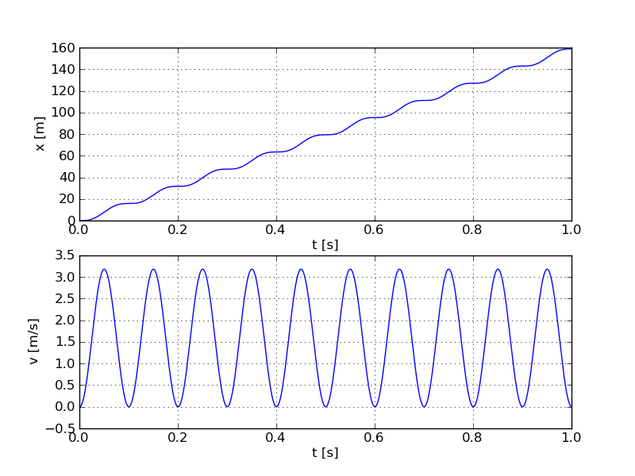

.. mpc documentation master file, created by
   sphinx-quickstart on Tue Sep 13 23:53:07 2011.
   You can adapt this file completely to your liking, but it should at least
   contain the root `toctree` directive.

Welcome to mpc's documentation!
===============================
mpc is a set of python module which provide tools for simulating discrete-time dynamic systems. 
mpc also features linear-quadratic control, model predictive control (not yet finished) and state 
observers.

Quick Example
=============
Let's simulate a double integrator system with a sinusoidal input::

    from mpc.systems import DoubleIntegrator
    
    # create a Double integrator object
    di = DoubleIntegrator( Ts = 0.1, x0 = [[0], [0]] )
    
    # set input sequence vector
    t = np.linspace(0,1,1000)
    u = np.sin(2*pi*10*t)
    
    # simulate system response
    y = di.simulate( u )
     
    # plot system response
    from pylab import *
    
    subplot(211)
    plot(t, y[0])
    xlabel('t [s]')
    ylabel('x [m]')
    grid()
    
    subplot(212)
    plot(t, y[1])
    xlabel('t [s]')
    ylabel('v [m/s]')
    grid()
    show()

This code produces the following figure.
    

   
For more involved examples see the examples in the tarball file.
     
Module Reference:
=================

.. toctree::
   :maxdepth: 2
   
   src/systems
   src/controllers
   src/simulation
   src/observers

Indices and tables
==================

* :ref:`genindex`
* :ref:`modindex`
* :ref:`search`

